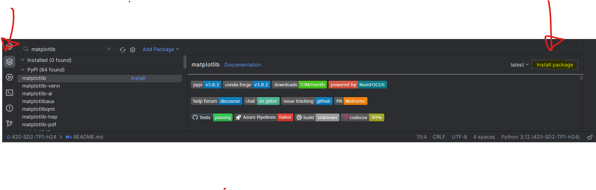

# Travail Pratique 1 - GéoPiscines et Classement
Travail Pratique 1 du cours de programmation orientée objet Hiver 2024

## Introduction
Le but du travail pratique est d'utiliser les notions de programmation orientée objet ainsi que l'utilisation de
structures de données de base. Le TP est divisé en deux parties:
1) Modéliser des piscines et des géométries de piscines
2) Implémenter un classement d'équipes de hockey

## Prérequis
1) Configurer l'interpréteur (virtual environnement)
2) installer le package matplotlib
   1) PyCharm: View -> Tool Windows -> Python Packages ou utiliser la vue package en bas à gauche
   2) Rechercher matplotlib (pas de 'h' à mat)
   3) cliquer "install package"
   
3) Vous avez le droit d'utiliser aussi les packages numpy et pandas au besoin.

## Première partie - GéoPiscines (10 points)
Bienvenue chez GéoPiscines! Vous avez été mandaté pour modéliser des piscines.

1) Implémenter la classe abstraite Piscine
   - La classe doit contenir les attributs suivants:
     - nom_modele: str
       - Le nom du modèle de la piscine
     - code: str
       - Le code du modèle de la piscine
     - profondeur: float
       - La profondeur de la piscine

   - La classe doit contenir les méthodes abstraites suivantes:
     - volume(self) -> float
       - Retourne le volume de la piscine
     - dessiner(self) -> None
       - Affiche un dessin de la piscine à l'aide d'un graphe matplotlib

2) Implémenter la classe PiscineRectangulaire dérivant de Piscine
   - C'est la piscine classique rectangulaire
   - La classe doit contenir les attributs suivants:
        - longueur: float
          - La longueur de la piscine
        - largeur: float
          - La largeur de la piscine
    
   - La classe doit implémenter les méthodes abstraites de Piscine
   
3) Implémenter la classe PiscineCylindrique dérivant de Piscine
   - C'est la piscine classique cylindrique
   - La classe doit contenir l'attribut suivant:
        - rayon: float
          - Le rayon de la piscine
    
   - La classe doit implémenter les méthodes abstraites de Piscine

4) Implémenter la classe PiscineHexagonale dérivant de Piscine
   - C'est la piscine classique ayant la forme d'un hexagone régulier
   - La classe doit contenir les attributs suivants:
        - longueur_cote: float
          - La longueur d'un côté de la piscine
    
   - La classe doit implémenter les méthodes abstraites de Piscine

### Notes:
   - Vous devez respecter les conventions de nommage PEP8
   - Vous devez respecter les noms et les types des attributs et des méthodes
   - Vous devez respecter le nom des classes
   - Vous devez ajouter des commentaires pour expliquer le code
   - Des exemples de matplotlib seront donnés lors des prochains cours
   - Ne pas oublier de mettre les noms des étudiants avec le nom d'utilisateur github en haut du fichier
   - Vous devez respecter l'encapsulation des attributs en utilisant les décorateurs @property et @attribut.setter
   - Votre code exécutable doit être dans la condition `if __name__ == "__main__":`

## Deuxième partie - Classement d'équipes de hockey (10 points)
Bienvenue chez ArbreLNH, la seule place où vous pouvez voir les équipes de la LNH classées en arbre binaire!

1) Implémenter la classe Noeud
   - Cette classe permet de créer un noeud d'un arbre binaire
   - La classe doit contenir les attributs suivants:
     - equipe: EquipeLNH
       - L'équipe de la LNH
     - gauche: Noeud
       - Le noeud de gauche
     - droit: Noeud
       - Le noeud de droite
   - Implémenter la méthode insertion(self, equipe: EquipeLNH) -> None
     - La méthode doit insérer une équipe dans l'arbre binaire
     - Si le nombre de points est plus petit que le noeud courant, l'équipe doit être insérée à gauche
     - Sinon, il doit être inséré à droite

2) Implémenter la classe EquipeLNH
   - Cette classe permet de créer une équipe de la LNH
   - La classe doit contenir les attributs suivants:
     - nom: str
       - Le nom de l'équipe
     - partie_jouees: int
       - Le nombre de matchs joués
       - Doit être supérieur à 0
     - victoires: int
       - Le nombre de victoires
       - Doit être supérieur ou égal à 0
     - defaites: int
       - Le nombre de défaites
       - Doit être supérieur ou égal à 0
     - defaites_prolongation: int
       - Le nombre de défaites en prolongation
           - Doit être supérieur ou égal à 0
     - buts_pour: int
       - Le nombre de buts pour
       - Doit être supérieur ou égal à 0
     - buts_contre: int
       - Le nombre de buts contre
       - Doit être supérieur ou égal à 0

   - La classe doit contenir les méthodes suivantes:
     - total_points(self) -> int
       - Retourne le total de points de l'équipe
       - Une victoire donne 2 points
       - Une défaite en prolongation donne 1 point
     - moyenne_but_par_match(self) -> float
       - Retourne la moyenne de buts_pour par match de l'équipe

3) Implémenter les méthodes manquantes de la classe DataUtils
   - Cette classe permet de manipuler des données d'équipes de la LNH
   - Une méthode charger_donnees(filename: str) -> List[dict] vous est fournie pour charger les données du classement
     - La méthode retourne une liste de dictionnaires
       - Chaque dictionnaire contient les statistiques d'une équipe
         - 'Equipe': str
           - nom de l'équipe
         - 'PJ': str
           - nombre de matchs joués
         - 'V' : str
           - nombre de victoires
         - 'D' : str
           - nombre de défaites
         - 'DP' : str
           - nombre de défaites en prolongation
         - 'BP' : str
           - nombre de buts pour
         - 'BC' : str
           - nombre de buts contre
       - Vous devrez convertir les valeurs en entiers (sauf le nom de l'équipe) pour intialiser les objets EquipeLNH
       - Un exemple d'utilisation de cette méthode est donné dans le code fourni
   - Implémenter la méthode statique moyenne_de_moyennes_buts_par_match(equipes: list[EquipeLNH]) -> float
     - Prend en entrée une liste d'équipes
     - Retourne la moyenne de buts par match de toutes les équipes (la moyenne des moyennes de buts par match)
   - Implémenter la méthode statique moyenne_bas_haut(liste_equipes: list[EquipeLNH]) -> tuple[list[EquipeLNH], list[EquipeLNH]]
     - Prend en entrée une liste d'équipes
     - Retourne 2 listes, bas et haut, dans cet ordre
       - bas contient les objets EquipeLNH dont la moyenne de buts par match est plus petite que la moyenne de toutes les équipes
         - La liste doit être triée par ordre décroissant de moyenne de buts par match
       - haut contient les objets EquipeLNH dont la moyenne de buts par match est égale ou supérieure à la moyenne de toutes les équipes
         - La liste doit être triée par ordre décroissant de moyenne de buts par match 

### Notes:
   - Vous devez respecter les conventions de nommage PEP8
   - Vous devez respecter les noms et les types des attributs et des méthodes
   - Vous devez respecter le nom des classes
   - Vous devez ajouter des commentaires pour expliquer le code
   - Ne pas oublier de mettre les noms des étudiants avec le nom d'utilisateur github en haut du fichier
   - Vous devez respecter l'encapsulation des attributs en utilisant les décorateurs @property et @attribut.setter
   - Votre code exécutable doit être dans la condition `if __name__ == "__main__":`

## Critères d'évaluation

   - Respect de l'encapsulation
   - Fonctionnalité du code
   - Respect des conventions Python (PEPs)
   - Présence de commentaires explicatifs du code

## Remise
Le fait de faire un "push" sur votre dépôt GitHub constitue une remise. En d'autres mots, la remise se fait au fur et à mesure
que vous faites les "push" de vos "commits". Assurez-vous de respecter l'heure de remise. 

## Bugs
Si vous trouvez des erreurs dans l'énoncé, merci de les signaler à l'enseignant.

## Tests
Si le temps le permet, des tests automatisés seront fournis pour valider votre code.